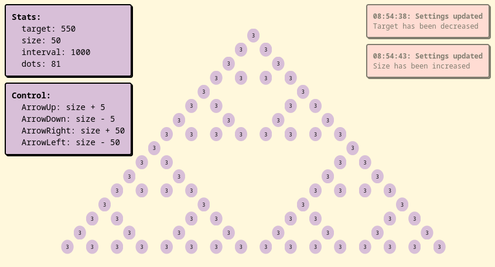

# sierpinski-triangle
Popularized by React Fiber demo.

## description
"simple" sierpinski-implentation in @mini-jail/signal and @mini-jail/dom.

## you can find it...
[here!](https://mini-jail-sierpinski.deno.dev/)

## screenshot

## build
`deno task build`

## serve
`deno task serve`

## comparison
* [React](https://claudiopro.github.io/react-fiber-vs-stack-demo/stack.html
)
* [React Fibre](https://claudiopro.github.io/react-fiber-vs-stack-demo/fiber.html)
* [Stencil](https://stencil-fiber-demo.firebaseapp.com/perf.html)
* [Glimmer](https://mupkoo.github.io/react-fiber-demo-with-glimmerjs/)
* [Aurelia](http://aurelia-thousand-nodes.bigopon.surge.sh/)
* [Imba](https://imba-perf-demo.firebaseapp.com/)
* [Radi](https://radi.js.org/perf-test.html)
* [Solid](https://ryansolid.github.io/solid-sierpinski-triangle-demo/)
